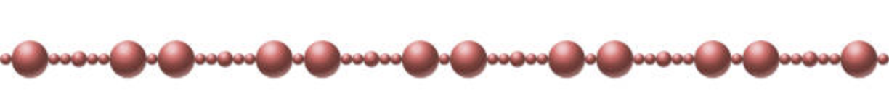
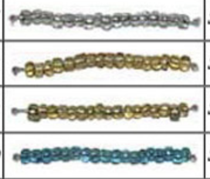
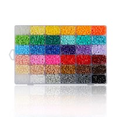

# Functional Thinking
## Inspiration
 Inspired by the work of [Alonzo Church](https://en.wikipedia.org/wiki/Alonzo_Church)(Lambda Calculus) & John Backus's paper '[Can programming be liberated...](https://github.com/van001/lesscode/blob/master/can-programming-be-liberated.pdf)', this is my first attempt to define a functional library/construct that could be implemented in any programming language that supports functional programming and can be applied to solve complex problems in variety of industry/ domain. 

> Lost in translation is real.

## Philosophy
> Universe is either expanding or contracting - Albert Eienstien.

In the grand scheme of things, the entire universe can be described in terms of few a abstractions. We call them the law of nature. Programming is no exception. While imperative thinking allows each individual to be an individual, it may confuse others if they are not used to "their" way of thinking :). Functional thinking abstracts the complexity (function) and opinion (implementation) & provide us a generic way to  communicate and work together. Nonetheless, we need both,  individualism and the ability to work/exist as a group.

> What if I ask you to reverse words in a sentence like 'my name is neelesh' -> 'neelesh is name my'

and you think
```
Sentence is a just a String of Strings (words) separated by a whitespace, so
1. Reverse the entire String so it becomes : 'hseleen si eman ym'
2. Transform the String into List of Strings : [ 'hseleen', 'si', 'eman', 'ym' ]
3. Apply reverse to all the Strings in the List : [ 'neelesh', 'is', 'name', 'my' ]
4. Transform the List of Strings to String again : neelesh is name my

or programatically :
const sreverseSentence = $(l2String2(space), lapply2(sreverse), s2List2(space), sreverse)
```
[reverse-sentence.js](https://github.com/van001/lesscode/blob/master/application/nodejs/algorithm/string/sreverseSentence.js)

> Or if I ask you to find intersection of 2 Lists of Strings : ['dog','cat','horse','mouse'] ⨅ ['dog','cat','bird'] = ['dog','cat']
```
And you say , 
1. If either of the Lists are empty, return the empty List : []
2. Transform one of the List to a Map (to save space convert smaller list to map) : {'dog':1,'cat':1,'bird':1}
3. Transform the Map to List by matching it against another List : [dog','cat']

or programatically : 
const lintersection2 = lst1 => lst2 => leqEmpty(lst1) || leqEmpty(lst2) ? [] : $(m2List2(lst2), l2Map)(lst1)

```
[intersection.js](https://github.com/van001/lesscode/blob/master/application/nodejs/algorithm/list/intersection.js)

** $ is a [composition function](https://github.com/van001/lesscode/blob/master/readme.md#3.) and functions are named with certain [rules](https://github.com/van001/lesscode/blob/master/readme.md#Function-naming).

Even-though it is started by an individual 'I', it cannot be functional unless it's adopted by 'You/We'. Please feel free to send me your your feedbacks, suggestions or whatever way you feel like connecting/ contributing. 
My email is neelesh.vaikhary@gmail.com
## Goal
> Eating your own dog food.

The initial goal is to influence programmers (including myself), to start thinking in terms of functional programming and construct programs using pure functions (no side-effect), function composition (lego blocks), fewer categories/ data-structures and tools (functions).

Eventually I want to solve many real-world complex problems and see how practical is it to do clutter-free programming using functional thinking.

> One of the finest display : [Compress a String](https://github.com/van001/lesscode/blob/master/application/nodejs/algorithm/string/scompress.js)

## Approach
I will try to solve [common algorithm and interview questions](https://github.com/van001/lesscode/tree/master/application/nodejs) using FP and see if it's possible to stick to the [design principles outlined below](https://github.com/van001/lesscode/blob/master/readme.md#Design). I will use javscript for the initial implementation but the goal is to come up with a functional construct that is language independent and can be implemented in any language that supports functional programming.

I will also solve real-world programming problems like making Http calls, Fetching data from database etc and that is when I will introduce parallel composition techniques.

I will not impelement any number or mathemetical functions but reuse it form the stardard libraries provided by the language itself.

## Design
> I like to [KISS](https://en.wikipedia.org/wiki/KISS_principle) ;)

The goal of any functional programming language is to have pure functions (function without any side effect), fewer constructs (lego blocks or moving parts) to deal with & ways to compose those functions to do complex things (glue/ attach).

### 1. Fewer objects and categories
I will start with frequently used objects and categories that are used in real-world to solve many complex business problems. 

Single object will belong to String category and bunch of objects will belong to either List or Map. 

#### String (single object)

String may conatin bunch of characters. e.g, 
```
'Neelesh Vaikhary'
```

#### List (container - multiple objects; serially accessible) 


List may contain list of Strings or List itself.
```
['My','Name','is','Neelesh Vaikhary']
```

#### Map (dictionary - multiple objects; randomly accessible via key)


Map may contain another String, List or a Map, uniquely itendified by a key (String). 
```
{
    'name' : 'Neelesh Vaikhary',
    'address' : {
                    'city': 'San Francisco',
                    'state':'CA'
                },
    'patents' : ['123','456','8910']
}
```
Most programming language provide the implementation of the above categories, so we may not have to implement but just use them.
In future I may use this base object and categories to build complex categories like Heap, Tree & Graph.

### 2. Pure Functions 
> Be a rebel but have few rules in life.

For each of the above categories(String, List & Map), I will build functions to consume & transform (similar or other) categories.

#### Function-naming

> Will the real slim shaddy, please standup, please standup...

Name makes a huge difference. Just looking at the function name we should be able to tell on what category it applies, what it does and what is the arity. 
I suggest we name functions as 
```
<l|s|m>[2|X]<operation>[arity] 

e.g. 
suppercase - function to convert String to uppercase String
lXhead  - function to retrieve head of the List
l2Map2 - function to transform List to Map
```
> Where <l|s|m> denote category - String, List or Map; [2|X] denote category transformation; <operation> - what function does; arity - how many parameters it takes. 2 or 3 denotes 2 or 3 parameters 'A' denotes arbitrary. 

By default last parameter of a function acts on the object from the same category on which it is defined.
```
const sreplace3 = pattern => replaceWith => str =>  str.replace(pattern,replaceWith) 
```

#### Single-input 
Most of the functions will have only one input and one output. Both input and/or output can be functions.
```
const lhead = l => l[0]
```
> 'l' denotes a List function, head tells about the operation. A single input function defined for a given category will always act on the same category object - List, String or Map

#### Multiple-input 
###### Currying
I will use [Currying](https://en.wikipedia.org/wiki/Currying) to define functions with more than one parameter and upto 3 parameters, after which function will have arbitrary paramaters. If a function takes more than one parameter we post-fix the name with no. of parameters (up to 3). 
```
const sreplace3 = pattern => replaceWith => str =>  str.replace(pattern,replaceWith) 
```
> 's' denotes a String function, replace tells us about the operation, 3 tells that function takes 3 parameters. 

Currying also helps us to partially apply a function so that we can use it over
```
const sreplace3 = pattern => replaceWith => str =>  str.replace(pattern,replaceWith) 

const replaceNYCWithJKF = sreplace3(/JFK/)('NYC')
```
> You can use replaceNYCWithJKF over and over to replace 'NYC' with 'JFK' for multiple strings. Just make sure that the last paramter should be the object on which the function would apply.
#### Category-helpers
Category helper functions transform one category to another preserving the structure. String remains String, List remains List and Map remains Map.

```
// String helper functions :
supperCase - converts String characters to uppercase
scapitalize - converts the 1st character of a String to uppercase
...

//List helper function

//Map helper function
```

#### Category-transformer
Category transformer functions transform one category to another without preserving the structure. String becomes List, List becomes String or Map, Map becomes List or String.

```
String to :


List to :
const l2Map2 = map => lst => lst.reduce((acc, val) => { acc[val]) ? acc[val] += 1 : acc[val] = 1; return acc }, map)
const l2String2= ptrn => lst => lst.join(ptrn)

Map to : 
const m2List2 = lst => map => lst.filter( val => map[val] !=null)
```
> 

#### Point-free-style
I will write functions in [point free style](https://en.wikipedia.org/wiki/Tacit_programming), as much as possible. 
```
const space = ' '
const l2String = lst => lst.join(space)
```
> l2String is declared in Point free style 


### 3. Function composition
> Whole is greater than the sum of parts.

A single function is limited, but combined can accomplish major task. I will define clear composition strategy to combine functions from similar or different categories, or the functions that transform categories (String to List, List to Map etc).


> I will define composition function as '$'. It will be of arbitrary arity, so won't use currying. Also since it's a one of kind, we will not say $A (used lated for special case), but simple $. Eventaully I will define parallel composition using $$, $$$, $$$$ or $A, to allow upto 3 parallel composition or parallel composition of any arity ($A).

#### Structure preserving functions
By default all the functions that preserve the structure are composable within that category.
```
```

#### Non-structure preserving functions
After applying non-structure preserving function you can keep composing with structure preserving functions of the transformed category.
```
const { $,  l2String2, lapply2, space, s2List2, sreverse} = require('../lib/lc-core')

/** 
reverse words in a sentence :: 'my name is neelesh' -> 'neelesh is name my'
1. reverse the string
2. split string into list of strings
3. Apply reverse operation to all items in the list
4. Convert List back to String
**/

const reverseSentence = $(l2String2(space), lapply2(sreverse), s2List2(space), sreverse)

console.log(reverseSentence('my name is neelesh'))
```
> After s2List2 (String to List transformation), one could only compose with List functions - lapply2, l2String2 etc.

$ is a composition function. Enabling print with $p, we get

```
hseleen si eman ym // sreverse
[ 'hseleen', 'si', 'eman', 'ym' ] // s2List2(space)
[ 'neelesh', 'is', 'name', 'my' ] // lapply2(sreverse)
neelesh is name my // l2String2(space)
```

[Function Library](https://github.com/van001/lesscode/blob/master/application/nodejs/lc-core.js)

## Application
> There is a saying in the valley - ideas are dime a dozen. So let's execute & prove it...

1. [Common algorithm and interview questions](https://github.com/van001/lesscode/tree/master/application/nodejs)


